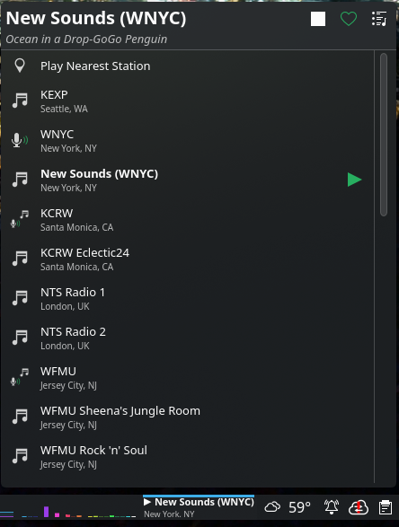

# Patron Radio

Patron Radio is a native KDE Plasma 6 panel widget for streaming independent and public radio stations. It was built to scratch an itch -- there was no simple, well-integrated way to listen to internet radio directly from the Plasma panel. Rather than running a full media player for something that should be a one-click action, Patron Radio brings station streaming into the desktop as a compact quality-of-life widget.



## Project Genesis

Patron Radio started as an experiment in building production software with AI coding agents. The initial implementation was generated with **Google Gemini**, then refined and cleaned up with **Claude Code**. The goal was to see how far agent-generated code could go toward a real, shippable Plasma widget -- from C++ backend through QML UI to packaging.

## Support Your Stations

Independent and public radio stations are vital to local culture and musical discovery. Patron Radio makes it easy to give back to the stations you listen to.

*   **One-Click Donate**: When a station supports donations, a heart icon appears in the widget header. One click takes you to their pledge page.
*   **Station Links**: Direct links to station websites for playlists and community events.

## Architecture

Patron Radio is a hybrid QML/C++ Plasma widget. The UI layer is pure QML (as is standard for Plasma plasmoids), but the audio backend is a native C++ plugin loaded at runtime. The C++ layer exists to work around two limitations in Qt6's QML multimedia APIs:

*   **ICY stream metadata**: `QMediaPlayer` in Qt6 does not surface Shoutcast/Icecast `StreamTitle` metadata to QML ([QTBUG-107661](https://bugreports.qt.io/browse/QTBUG-107661)). The C++ backend includes a custom `IcyStreamReader` that intercepts the raw HTTP stream, parses the ICY metadata frames, and exposes the current track title to the UI.
*   **Audio device routing**: Changing `QAudioOutput.device` from QML does not reliably re-route audio in widget contexts, particularly when running inside the `plasmashell` process where all audio shares a single PulseAudio/PipeWire client ([QTBUG-108383](https://bugreports.qt.io/browse/QTBUG-108383)). The C++ backend manages device enumeration and switching directly through `QMediaDevices` and `QAudioOutput`, with explicit stop/restart logic to force the route change.

> **Future TODO**: If these upstream issues are resolved in a future Qt release, the C++ shim could be replaced with pure QML `MediaPlayer` / `AudioOutput` components, eliminating the need for a compiled plugin entirely.

## Features

*   **Independent Radio Focus**: Pre-configured with a selection of world-class independent stations.
*   **Support Your Stations**: Integrated **Donate** buttons make it easy to support the independent broadcasters you love with a single click.
*   **Loudness Normalization**: Evens out the often-jarring volume differences between stations using EBU R128 loudness measurement, so switching never blasts or whispers. Levels are learned per station and can be overridden by hand. See below.
*   **MPRIS Integration**: Fully controllable via the standard Plasma Media Controller, lock screen, and keyboard media keys.
*   **Smart Hardware Routing**: Define a prioritized list of audio devices; the widget automatically routes audio to the best available sink upon connection.
*   **Autoplay Triggers**: Automatically start your favorite station when your headphones or speakers connect.
*   **Dynamic Metadata**: Extracts live "StreamTitle" information even from streams that standard players often miss.
*   **Compact Marquee**: A polished panel widget that scrolls long track titles to save space.
*   **Station "Fix" Tool**: Automatically searches for replacement stream URLs if a station goes offline.

## Loudness Normalization

Internet radio streams are mastered at wildly different levels -- the bundled stations span roughly 13 dB -- so hopping between them means constantly reaching for the volume knob. Patron Radio fixes this the way streaming services do: with **loudness normalization** rather than crude AGC.

*   The C++ backend taps the decoded audio (via `QAudioBufferOutput`) and measures **integrated loudness** with [libebur128](https://github.com/jiixyj/libebur128) (EBU R128 / ITU-R BS.1770). Integrated loudness is a stable per-station offset, not a moving gain, so it doesn't pump or breathe.
*   Stations louder than the **-23 LUFS** target are attenuated down to match; quieter ones are left as-is (`QAudioOutput` can't amplify past your volume, so it's attenuation-only -- set your master volume once and every station sits at the same level).
*   Each station's measured loudness is **remembered**, so returning to it is leveled instantly, and the bundled stations ship with pre-measured values.
*   Prefer to set levels yourself? Turn off **Measure levels automatically** in the settings and the per-station attenuation becomes an editable field that's never overwritten.

It can be disabled entirely from the widget's behavior settings.

## Dependencies

To build and run Patron Radio, you need the following packages:

### Fedora
```bash
sudo dnf install qt6-qtdeclarative-devel qt6-qtmultimedia-devel kf6-kcoreaddons-devel kf6-kconfig-devel kf6-ki18n-devel kf6-kio-devel libebur128-devel cmake extra-cmake-modules kf6-bluez-qt
```

### Arch Linux
```bash
sudo pacman -S qt6-declarative qt6-multimedia kcoreaddons kconfig ki18n kio libebur128 cmake extra-cmake-modules bluez-qt
```

### Ubuntu / KDE Neon
```bash
sudo apt install qt6-declarative-dev qt6-multimedia-dev libkf6coreaddons-dev libkf6config-dev libkf6i18n-dev libkf6kio-dev libebur128-dev cmake extra-cmake-modules qml6-module-org-kde-bluezqt
```

The bluez-qt package (last in each list) is not needed to compile — it provides the `org.kde.bluezqt` QML module the widget loads at runtime for Bluetooth autoplay triggers.

## Build & Installation

You can use the provided installation script for a quick setup:

```bash
chmod +x scripts/install.sh
./scripts/install.sh
```

### Manual Build

If you prefer to build manually:

1.  **Create a build directory**:
    ```bash
    mkdir build && cd build
    ```
2.  **Configure and build** (installing to your user directory, no root needed):
    ```bash
    cmake .. -DCMAKE_INSTALL_PREFIX=$HOME/.local
    make
    ```
3.  **Install**:
    ```bash
    make install
    systemctl --user restart plasma-plasmashell
    ```

    For a system-wide install instead, configure with `-DCMAKE_INSTALL_PREFIX=/usr` and run `sudo make install`.

## Usage

After installation, add the **Patron Radio** widget to your Plasma panel or desktop via the standard "Add Widgets" menu.

## Privacy

Patron Radio contacts only the services needed to do its job, and only when you use the corresponding feature:

*   **Station stream servers** -- directly, when you play a station.
*   **get.geojs.io** -- IP-based geolocation, used only by "Play Nearest Station" and the *Select closest local station on startup* option.
*   **radio-browser.info** -- a community station directory, queried only when you use the "Fix" tool to find a replacement stream.

There is no telemetry and no account of any kind.

## Contributing

See [CONTRIBUTING.md](CONTRIBUTING.md) for code style, architecture constraints, git workflow, and testing guidelines. AI coding agents: see [AGENTS.md](AGENTS.md).

## License

This project is licensed under the GPL-3.0+ License.
