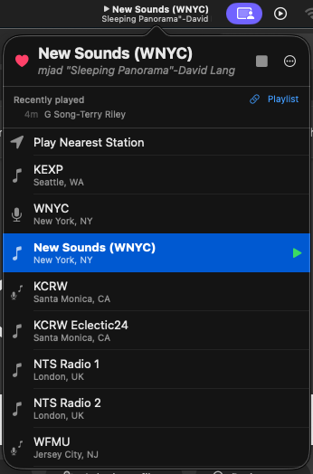
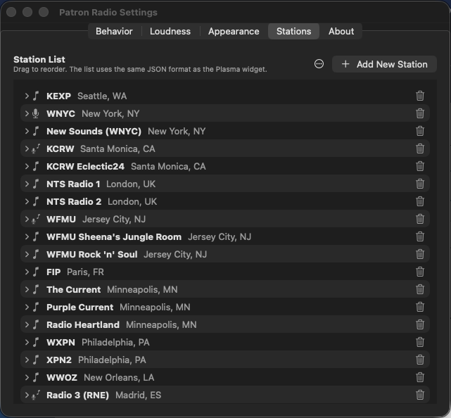
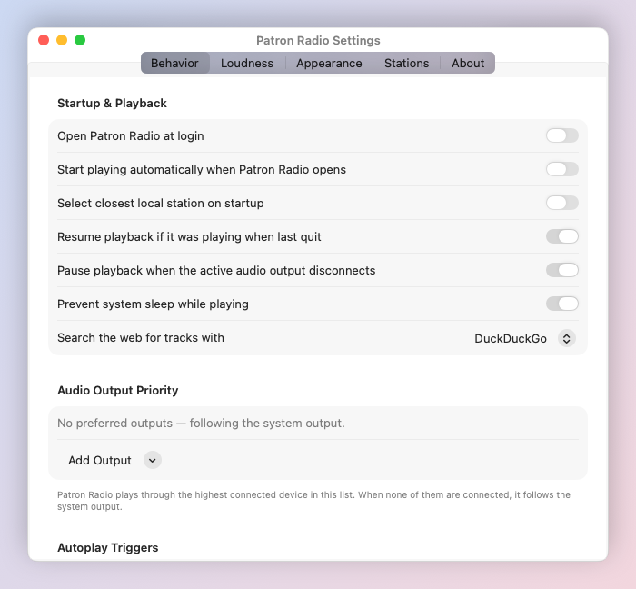

# Patron Radio for macOS

A native menu bar companion to the Patron Radio KDE Plasma widget ([`../`](../README.md)):
one-click streaming of independent and public radio, with a donate button for the station you're listening to.

It ships the same curated station list, the same loudness normalization, and the same "Fix" and "Play Nearest
Station" tools. It also reads and writes the widget's station JSON format. The widget keeps its list in the
`stationsJson` key of `~/.config/plasma-org.kde.plasma.desktop-appletsrc`, so that value can be saved to a
`.json` file and imported here with Settings › Stations › Import. Export works the same way in the other direction.

<p align="center">
  
</p>

<p align="center">
  
  
</p>

## Features

| Plasma widget | macOS app |
|---|---|
| Panel widget with state glyph, station name, marquee subtitle | Menu bar item with the same two-line layout (or icon only) |
| Popup: donate heart, now playing, transport, recents, station list | Popover with the same layout; ↑/↓ + Return to pick a station |
| Right-click context menu / overflow menu | Right-click (or ⌃-click) menu; the popover's ⋯ menu uses the same list |
| Middle-click toggles playback | Middle-click toggles playback |
| C++ `IcyStreamReader` for ICY `StreamTitle` | `IcyDemuxer` + `StreamSession` (URLSession → AudioFileStream → AVAudioConverter → AVAudioEngine) |
| EBU R128 loudness normalization via libebur128 | Built-in EBU R128 integrated-loudness meter (validated against Tech 3341 test signals) |
| MPRIS (Plasma media controller, media keys, lock screen) | Now Playing in Control Center, media keys, AirPods/headset buttons |
| logind sleep inhibitor | IOKit power assertion (`PreventUserIdleSystemSleep`) |
| Audio output priority + manual routing | Same, using CoreAudio device UIDs |
| Bluetooth autoplay triggers / pause on disconnect | Same, for Bluetooth outputs; pause fires for whatever output was in use |
| KDE web shortcuts for track search | Choice of DuckDuckGo, Google, Bing, Kagi or Startpage |
| "Start on login" | Login item via `SMAppService` |

Behavior that's deliberately the same: reconnect with exponential backoff and jitter (2 s → 30 s, 10 attempts),
a 7 s stall watchdog, 2 s pre-roll, attenuation-only normalization to −23 LUFS with a −16 LUFS assumption for
unmeasured stations, a 1 dB/tick gain slew, the 20 s debounce that keeps station IDs out of "Recently played",
and the http(s)-only / non-routable-IP guards on untrusted URLs (including every redirect hop).

A few small differences from the widget:

- **Output priority** only lists devices you add. If none of them is connected, the app follows the macOS system output instead of the first device it ever saw.
- **Pause on disconnect** watches whichever output is actually playing, including the system default. So when AirPods drop out, the radio pauses instead of switching to the laptop speakers.
- **Stop while buffering:** clicking the transport button while it's buffering stops playback, as its tooltip says.
- **Codec and bitrate** from the stream headers appear in the tooltip.

## Requirements

macOS 14 Sonoma or later, Xcode 16+ (Swift 6 toolchain). Universal binary (Apple silicon + Intel).

## Build & run

Everything below runs from this `macos/` directory.

```bash
scripts/build-app.sh            # → dist/Patron Radio.app (ad-hoc signed)
open "dist/Patron Radio.app"
```

To distribute, sign with a Developer ID and notarize:

```bash
SIGN_IDENTITY="Developer ID Application: Your Name (TEAMID)" scripts/build-app.sh
ditto -c -k --keepParent "dist/Patron Radio.app" PatronRadio.zip
xcrun notarytool submit PatronRadio.zip --keychain-profile <profile> --wait
xcrun stapler staple "dist/Patron Radio.app"
```

For development, `swift run PatronRadio` works too, or open `Package.swift` in Xcode.

## Tests

```bash
swift test
```

The tests use Swift Testing. They cover the ICY demuxer and HTML-entity decoding (from the shared vectors),
the loudness policy and meter calibration, URL safety, reconnect backoff, station JSON compatibility,
and the playback controller's state machine with a fake backend. Like the widget's tests, none of them touch
the network or audio hardware.

The screenshots above are real screen captures (Screenshot.app, dark appearance), cropped to the menu bar item
and popover or to the Settings window, and saved in `docs/screenshots/`.

Headless visual check (debug builds only): `swift run PatronRadio --snapshots /tmp/snaps [--light|--dark]`
renders the popover, menu bar item and every settings tab to PNGs, plus `real-popover.png` and
`real-button.png` captured from the actual popover and status item windows. Trust the `real-*` captures:
offscreen renders lack menu bar vibrancy and have hidden real bugs. Snapshot mode starts real playback (it
needs the network), and the unbundled debug binary keeps its settings in a separate `PatronRadio` defaults
domain (`defaults delete PatronRadio` to reset).

## Layout

```
Sources/PatronRadioCore/     testable core, no UI
  StreamSession.swift        HTTP → ICY → packet parser → decoder → engine (one private queue)
  RadioBackend.swift         reconnect/backoff, stall watchdog, loudness gain, sleep assertion
  RadioController.swift      playback state machine, stations, history, routing, Fix/Nearest
  IcyParser.swift            ICY demux, StreamTitle extraction, entity decoding
  Loudness.swift             normalization policy + EBU R128 meter
  AudioDevices.swift         CoreAudio output enumeration and change monitoring
  AppSettings.swift          UserDefaults-backed preferences (keys mirror main.xml)
  DefaultStations.swift      generated from the widget's main.xml
Sources/PatronRadio/         the menu bar app (AppKit status item + SwiftUI views)
Tests/PatronRadioCoreTests/
```

`DefaultStations.swift` is generated from the widget's `../contents/config/main.xml`, which stays the single
source of truth. After changing that list, run `scripts/sync-stations.sh`; a test fails if the two drift apart.

Rules both apps must agree on (HTML entity decoding in stream titles, the loudness gain policy) are written
once as test vectors in [`../tests/data/`](../tests/data/README.md) and loaded by both test suites.

## UI implementation notes

Menu bar and popover pitfalls, all explained where they bite in code comments:

- Don't use hierarchical styles (`.secondary`, `.opacity` on text) inside clipped layers on the menu bar or
  popover. Vibrancy blending makes the text vanish. Pass concrete colors, as `Marquee` does.
- The status item is 21–22 pt tall. Its two-line label is drawn by an AppKit view (`StatusLabelView`), not
  SwiftUI, so baselines, the state glyph and the scroll offset land on whole pixels. SwiftUI placed those tiny
  fonts at fractional baselines, which looked blurry on 1x displays. Keep its font sizes whole points.
- The status item's width comes only from `statusItem.length`, and long titles scroll inside it.
  In SwiftUI (the popover), `Marquee` reports zero ideal width for the same reason.
- Give the popover its fixed size before `show`, and keep `sizingOptions = []` on its hosting controller.
  Letting SwiftUI resize it after showing re-anchors it off the top of the screen.
- The app's settings type is `AppSettings`, because `Settings` collides with SwiftUI's scene type.

## Privacy

The app only contacts what it needs, and only when you use the feature that needs it:
- **Station stream servers**, when you play a station.
- **get.geojs.io**, only for "Play Nearest Station" and "Select closest local station on startup".
- **radio-browser.info**, only for the "Fix" tool.

There's no telemetry and no account.

## License

GPL-3.0-or-later, same as the Plasma widget; see [`../LICENSE`](../LICENSE).
